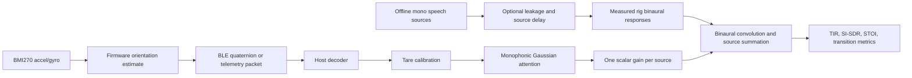
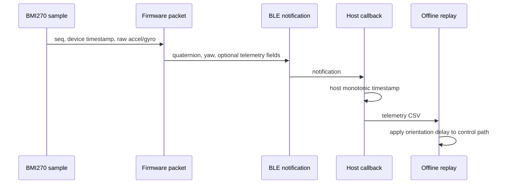

# Architecture

```mermaid
flowchart LR
  BMI270["BMI270 accel/gyro"] --> FW["Firmware orientation estimate"]
  FW --> BLE["BLE quaternion or telemetry packet"]
  BLE --> DEC["Host decoder"]
  DEC --> CAL["Tare calibration"]
  CAL --> ATT["Monophonic Gaussian attention"]
  ATT --> GAIN["One scalar gain per source"]
  SPEECH["Offline mono speech sources"] --> SEP["Optional leakage and source delay"]
  SEP --> BRIR["Measured rig binaural responses"]
  BRIR --> RENDER["Binaural convolution and source summation"]
  GAIN --> RENDER
  RENDER --> METRICS["TIR, SI-SDR, STOI, transition metrics"]
```

The attention model remains monophonic. Measured two-channel room transfer
responses are applied only in the offline acoustic renderer.

## Timing Path

```mermaid
sequenceDiagram
  participant IMU as BMI270 sample
  participant FW as Firmware packet
  participant BLE as BLE notification
  participant Host as Host callback
  participant Replay as Offline replay
  IMU->>FW: seq, device timestamp, raw accel/gyro
  FW->>BLE: quaternion, yaw, optional telemetry fields
  BLE->>Host: notification
  Host->>Host: host monotonic timestamp
  Host->>Replay: telemetry CSV
  Replay->>Replay: apply orientation delay to control path
```
